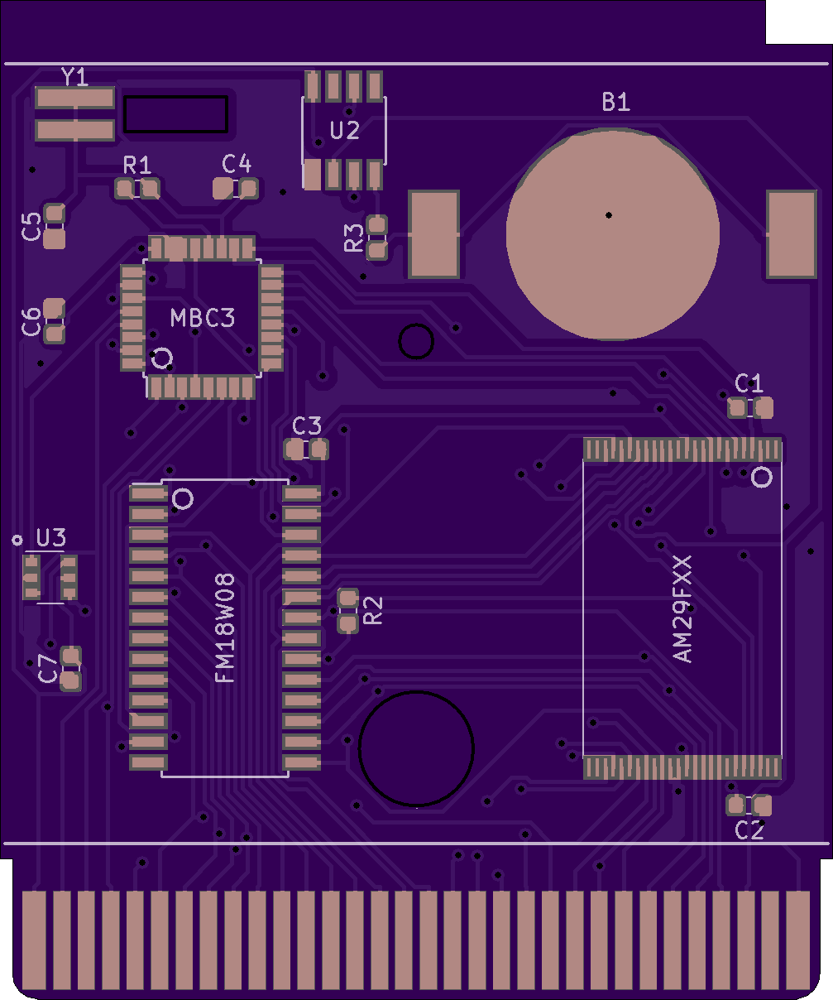
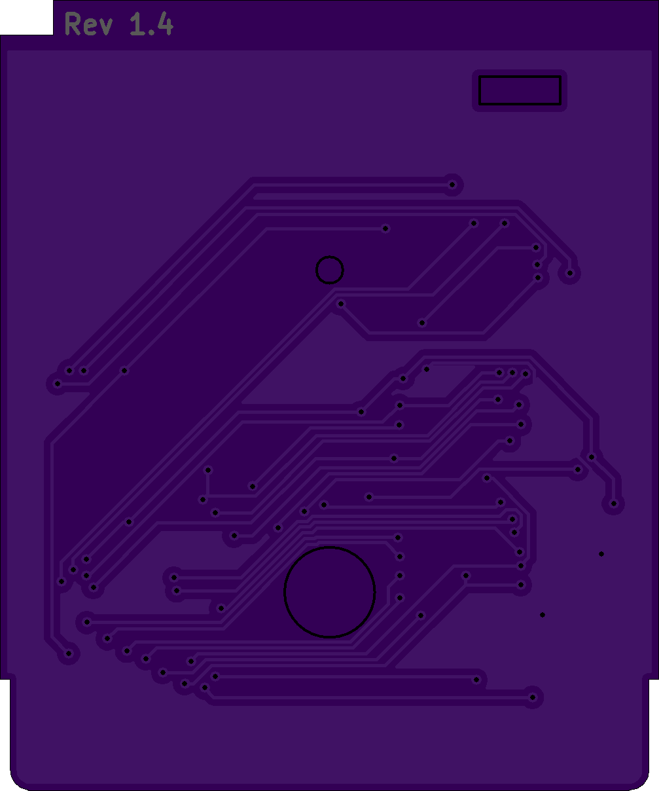

MBC3 Flashcart based on retroreboot's cartridge that uses 0603 components and has added support for 4MB roms

Order at 0.8mm not 1.6!!!

[Purchase on OSHPARK](https://oshpark.com/shared_projects/Qqr82n7y)

## BOM

| Reference        | Part Number           | Description  |
| ------------- |:-------------:| -----:|
| B1 | BK-6219-TR | CR2025 Coin Cell Retainer |
| C1 | 06033C104KAT4A | 0.1uF Capacitor |
| C2 | 06033C104KAT4A | 0.1uF Capacitor |
| C3 | 06033C104KAT4A | 0.1uF Capacitor |
| C4 | CL10C150JB8NNNC | 15pF Capacitor |
| C5 | CL10C150JB8NNNC | 15pF Capacitor |
| C6 | 06033C104KAT4A | 0.1uF Capacitor |
| C7 | 06033C104KAT4A | 0.1uF Capacitor |
| FM18W08 | FM18W08 | 256kbit FRAM |
| R1 | ERJ-PA3J334V | 330K Ω Resistor |
| R2 | ERJ-PA3J103V | 10K Ω Resistor |
| R3 | ERJ-PA3J102V | 1K Ω Resistor |
| MBC3 | MBC3 | Get from real cartridge |
| U2 | BA6129AF | Buy or get from real cartridge |
| U3 | 74LVC1G332GV,125 | 3-input OR gate TSOP-6 |
| AM29F0XX | AM29F016 or AM29F032 | 2MB or 4MB Rom Chip TSOP-48 |
| Y1 | R26-32.768-12.5-10PPM | R26 12.5pF 32.768 kHz Crystal |

## Changelog:

**1.2:**
- Fixed missing traces

**1.3:**
- Fixed some trace issues with Y1
- Rerouted the pcb entirely

## Images

